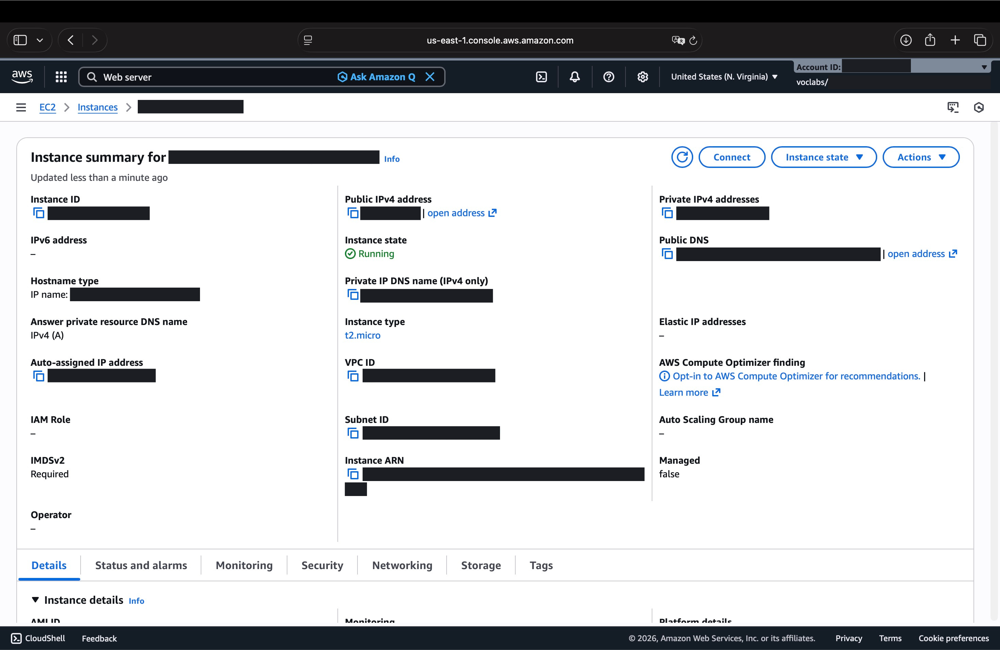
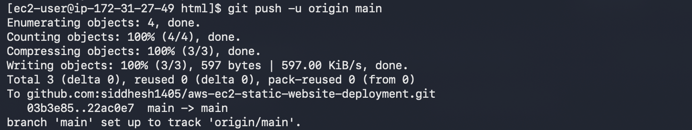
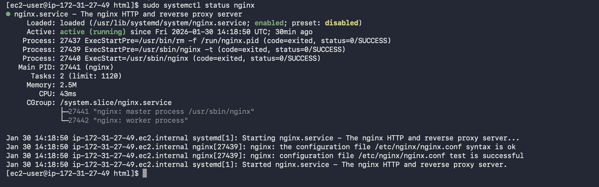
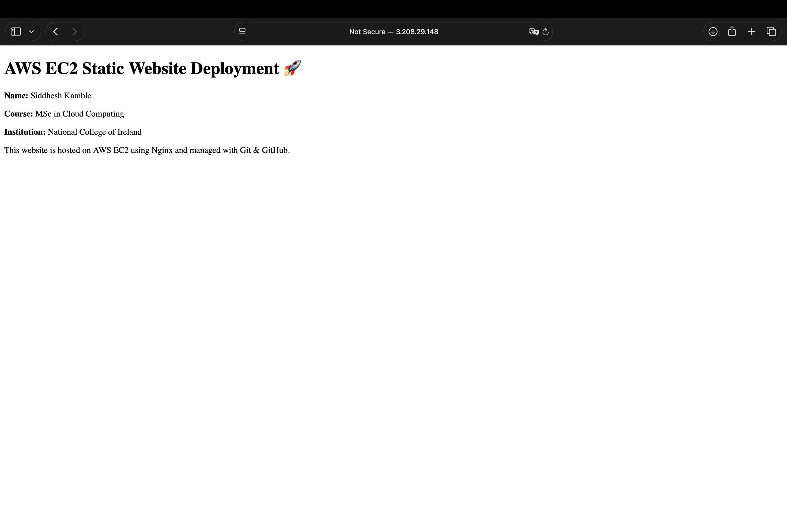

# AWS EC2 Static Website Deployment 🚀

## Overview
This project demonstrates deploying a static website on an AWS EC2 instance using **Nginx**, secured via **SSH**, and version-controlled with **Git & GitHub**.

The project showcases real-world cloud infrastructure setup, Linux server management, and deployment troubleshooting.

---

## Tech Stack
- AWS EC2 (Amazon Linux 2023)
- Nginx
- Linux (SSH, systemctl, permissions)
- Git & GitHub

---

## Architecture
- Static website hosted on EC2
- Nginx used as the web server
- SSH-based authentication for secure access
- GitHub repository used for version control and documentation

---

## Deployment Steps
1. Launched EC2 instance and configured Security Groups (HTTP, SSH)
2. Connected securely using SSH key pair
3. Installed and configured Nginx
4. Deployed static website to `/usr/share/nginx/html`
5. Enabled and verified Nginx service
6. Synced deployment with GitHub repository

---

## Proof of Deployment

### EC2 Instance Running

### Git Push from EC2

### Nginx Service Status

### Live Website

---

## Outcome
- Live static website hosted on AWS EC2
- Clean Git commit history
- Production-style deployment workflow

---

## Author
**Siddhesh Kamble**  
MSc in Cloud Computing – National College of Ireland
